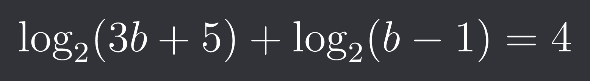
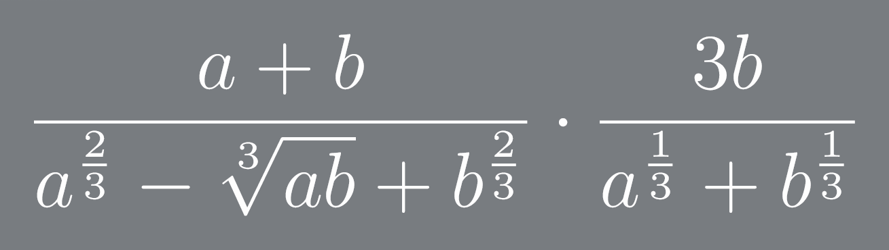
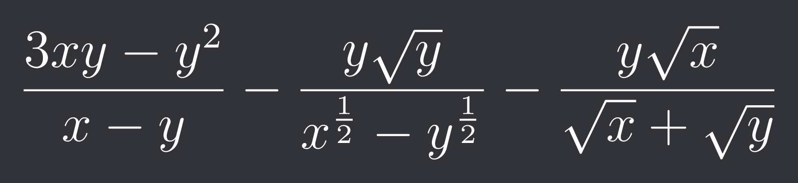

## Hi there 👋

I'm a developer focused on clean, efficient, and scalable code. My projects often explore the intersections of web development, scripting, and user experience, with a particular interest in TypeScript, SCSS, and JavaScript.

# What I Do:

   + Web Development: Building seamless front-end experiences with HTML, CSS/SCSS, and JavaScript/TypeScript.
   + Problem Solving: Passionate about optimizing code and enhancing functionality through thoughtful refactoring.
   + Learning & Sharing: Constantly diving into new technologies and sharing insights from my journey as a developer.

# Languages & Tools I Use:

  + Languages: TypeScript, JavaScript, SCSS, HTML, and more.
  + Tools: Git, GitHub, VS Code, and other developer essentials.

# Other things I do:

I really, really like maths, and I think maths can be made fun. 

So, I have decided to list a couple of my favourite maths equations that may change one's perspective on maths.

<!-- subsititue b for next equation -->

<!-- b=y (next equatiton) -->

# 💻 Check out my repos to see my latest work, and feel free to contribute or get in touch!

<!--
the keys are somewhere here
-->
